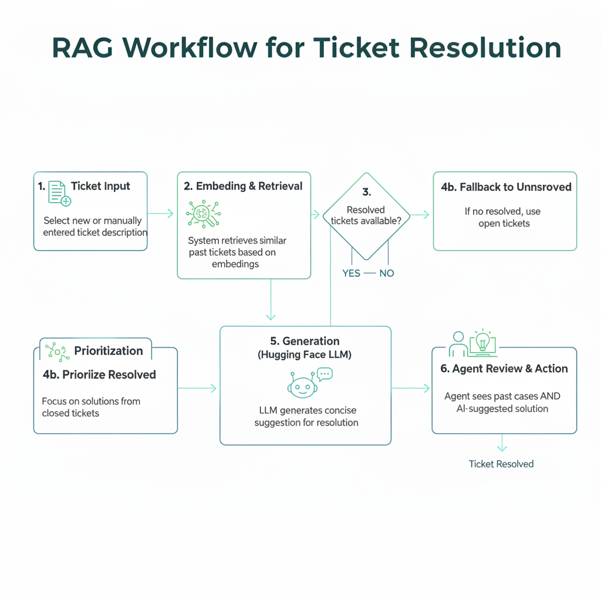

# IT Helpdesk Ticket Assistant
A Retrieval-Augmented Feneration (RAG) prototype to assist IT heldesk agents by suggesting resolutions for new tickets based on previously resolved tickets.

## Features
- Data Loader: Ingests tickets from Excel, CSV and Json, normalizes schema, and handles missing values.
- Embedding Model: Generates sentence embeddings usinh Sentence Transformers and computes similarity scores with cosine similarity.
- Retrieval Logic: Finds top-k similar tickets (prefers resolved ones, falls back to unresolved if needed).
- Generation Model: Uses Hugging Face LLMs to generate a concise suggestion for solving new tickets.
- Streamlit App: User-friendly interface for IT agents to explore similar tickets and AI-generated resolutions

## Architecture


## Assumptions and Considerations
- Dataset Size:
  - The provided dataset has ~ 30 historical tickets.
  - Cosine similarity is sufficient for retrieval at this scale. For larger datasets vector databases (FAISS, Pinecone) would be required.
- Ticket Quality:
  - Historical tickets are assumed to have clear problem and solution descriptions.
  - If past solutions are incomplete or vague, retrieval quality will drop.
- Resolved vs Unresolved tickets:
  - Resolved tickets are considered more relaiable for generating suggestions.
  - Unresolved tickets are only used as a fallback with reduced confidence.
- Language:
  - All tickets are in English and the system does not handle multilingual inputs at this stage.
- Similarity Threshold
  - A cutoff (0.4) is applied to filter out irrelevant matches.
  - Threshold chosen emprically from experimentation.
- Embedding Model Choice:
  - `all-MiniLM-L6-v2` selected for speed and lightweight nature.
  - Works well for short description but may lose nuance for very long, complex tickets.
- Latency and API Limits
  - Hugging Face API may have rate limits and latency (~1-3s per call).
  - For production a self-hosted model or caching mechanism would be preferred.


## Project Structure
``` bash
IT-Ticket-RAG/
│── data/                     # Sample datasets (Excel, CSV, JSON, New Tickets)
│── src/                      # Source code modules
│   ├── data_loader.py        # Loads and preprocesses old & new tickets
│   ├── embedding_model.py    # Embedding model + similarity search
│   ├── generation_model.py   # Hugging Face LLM inference
│   ├── app.py                # Main Streamlit app
│── .env                      # Environment variables (not committed)
│── requirements.txt          # Python dependencies
│── README.md                 # Project documentation

```
## Setup Instructions
### 1. Clone the Repository
``` bash
git clone https://github.com/yourusername/IT-Ticket-RAG.git
cd IT-Ticket-RAG
```
### 2. Create a Virtual Environment
```bash
python -m venv venv
source venv/bin/activate   # On Linux/Mac
venv\Scripts\activate      # On Windows
```
### 3. Install Dependencies
```bash
pip install -r requirements.txt
```
### 4. Set Environment Variables
Create a .env file in the root folder
```env
EMBEDDING_MODEL=all-MiniLM-L6-v2
GENERATOR_MODEL=meta-llama/Llama-3.1-8B-Instruct
HF_API_TOKEN=your_huggingface_api_token
```
## Example Workflow
1. Select a new or manually entererd ticket description.
2. The system retrives similar past tickets based on embeddings.
3. It prioritizes resolved tickets and falls back to unresolved ones if needed.
4. A Hugging Face LLM generates a concise suggestion for resolution.
5. The agent sees both pasth cases amd the AI-suggested solution.

### Teck Stack
- Language Models: Hugging Face Interface API
- Embeddings: Sentence Transformers (`all-MiniLM-L6-v2`)
- Similarity Search: Cosine Similarity (Scikit-learn)
- Frontend: Streamlit
- Environment Management: dotenv
- Data Processing: Pandas

### Future Improvements
- Replace cosine similarity with vector databases (FAISS,Pinecone, Weaviate).
- Add evaluation metrics (Precision@k, Recall@k) to assess retrieval quality.
- Improve multi-lingual support for tickets.
- Optimize LLM prompts for shorter latency and lower cost.
- Deploy as a scalable API service instead of just a Streamlit app.
